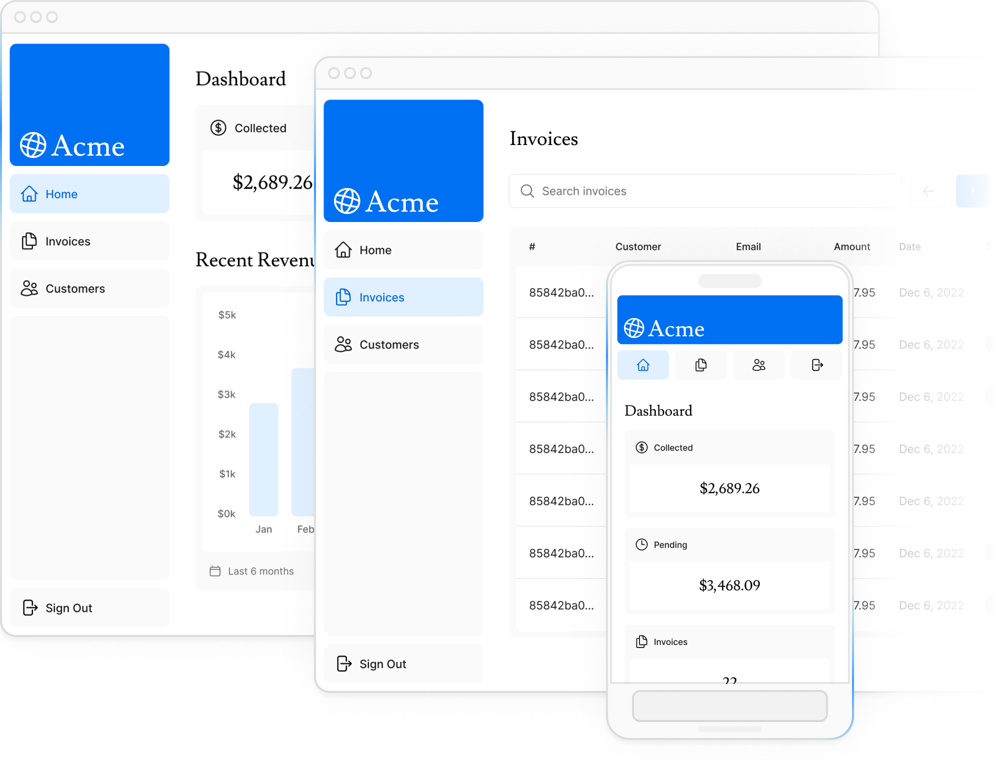
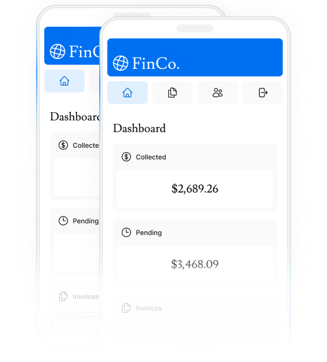

# Next.js Invoices Dashboard

A modern, full-stack invoice management application built with Next.js 14, TypeScript, and Tailwind CSS. This dashboard provides a complete solution for creating, managing, and tracking invoices with authentication and database integration.

## 🚀 Features

- **Modern UI/UX**: Clean, responsive design built with Tailwind CSS
- **Authentication**: Secure user authentication with NextAuth.js
- **Multiple Providers**: Support for Google and GitHub OAuth
- **Dashboard Analytics**: Comprehensive overview of invoice statistics
- **Customer Management**: Complete customer database with profiles
- **Invoice CRUD**: Create, read, update, and delete invoices
- **Real-time Updates**: Live data synchronization
- **Type Safety**: Full TypeScript implementation
- **Mobile Responsive**: Optimized for all device sizes

## 🛠 Tech Stack

- **Framework**: Next.js 14 (App Router)
- **Language**: TypeScript
- **Styling**: Tailwind CSS
- **Authentication**: NextAuth.js
- **Database**: PostgreSQL
- **Package Manager**: pnpm
- **Deployment**: Vercel ready

## 📸 Screenshots

### Dashboard Overview


### Mobile View


## 🚀 Quick Start

### Prerequisites

- Node.js 18+ 
- PostgreSQL database
- pnpm package manager

### Installation

1. **Clone the repository**
```bash
git clone <your-repo-url>
cd nextjs-invoices-dashboard
```

2. **Install dependencies**
```bash
pnpm install
```

3. **Set up environment variables**
Create a `.env.local` file in the root directory:

```bash
# Database
POSTGRES_URL=your_postgres_connection_string

# NextAuth.js
AUTH_SECRET=your_auth_secret_here
AUTH_URL=http://localhost:3000

# Google OAuth
GOOGLE_CLIENT_ID=your_google_client_id
GOOGLE_CLIENT_SECRET=your_google_client_secret

# GitHub OAuth
GITHUB_CLIENT_ID=your_github_client_id
GITHUB_CLIENT_SECRET=your_github_client_secret
```

4. **Set up OAuth Providers**

#### Google OAuth
1. Go to [Google Cloud Console](https://console.cloud.google.com/)
2. Create a new project or select an existing one
3. Enable Google+ API
4. Create OAuth 2.0 credentials
5. Add authorized redirect URI: `http://localhost:3000/api/auth/callback/google`

#### GitHub OAuth
1. Go to [GitHub Developer Settings](https://github.com/settings/developers)
2. Create a new OAuth app
3. Set Authorization callback URL: `http://localhost:3000/api/auth/callback/github`

5. **Initialize the database**
```bash
pnpm run db:setup
```

6. **Run the development server**
```bash
pnpm dev
```

Open [http://localhost:3000](http://localhost:3000) in your browser.

## 📁 Project Structure

```
├── app/                    # Next.js app directory
│   ├── api/               # API routes
│   ├── dashboard/         # Dashboard pages
│   ├── login/            # Authentication pages
│   └── lib/              # Shared utilities
├── public/               # Static assets
├── scripts/             # Database scripts
├── auth.config.ts       # Auth configuration
├── auth.ts             # NextAuth setup
└── tailwind.config.ts  # Tailwind configuration
```

## 🔧 Available Scripts

```bash
pnpm dev          # Start development server
pnpm build        # Build for production
pnpm start        # Start production server
pnpm lint         # Run ESLint
pnpm db:reset     # Reset database
pnpm db:update    # Update database schema
```

## 🚀 Deployment

### Vercel (Recommended)

1. **Connect to Vercel**
   - Push your code to GitHub
   - Import your repository in Vercel
   - Connect your GitHub account (already done)

2. **Environment Variables**
   Add all environment variables from your `.env.local` file to Vercel's environment settings

3. **Deploy**
   - Vercel will automatically deploy on every push to main
   - Or trigger manual deployment from Vercel dashboard

### Manual Deployment

```bash
pnpm build
pnpm start
```

## 🤝 Contributing

1. Fork the repository
2. Create your feature branch (`git checkout -b feature/amazing-feature`)
3. Commit your changes (`git commit -m 'Add some amazing feature'`)
4. Push to the branch (`git push origin feature/amazing-feature`)
5. Open a Pull Request

## 📝 License

This project is licensed under the MIT License - see the [LICENSE](LICENSE) file for details.

## 🆘 Support

If you have any questions or need help, please:

1. Check the [Next.js documentation](https://nextjs.org/docs)
2. Visit the [NextAuth.js documentation](https://next-auth.js.org/)
3. Open an issue in this repository

## 🔗 Links

- [Live Demo](https://your-app.vercel.app) *(Replace with your deployed URL)*
- [Next.js Documentation](https://nextjs.org/docs)
- [Tailwind CSS](https://tailwindcss.com/)
- [NextAuth.js](https://next-auth.js.org/)

---

Built with ❤️ using Next.js 14 and modern web technologies
